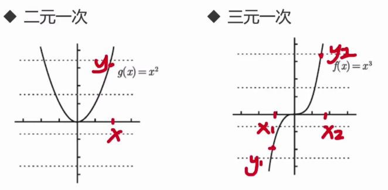

# React Hooks

- 什么是 Hooks
- 什么是纯函数
- 什么是副作用
- 有状态和无状态组件的区别
- 如何跨组件传递数据
- HOC 是什么意思

## 【概念理解】 什么是钩子(hooks)

非类组件中使用 state：

- 什么是 hooks
- hooks 产生的原因
- 常见的 hooks 函数

什么是钩子(hooks)

- 消息处理的一种方式，用来监视指定程序
- 函数组件中需要处理副作用，可以用钩子把外部代码“钩”进来
- 常见钩子：useState、useEffect、useContext、useReducer
- hooks 一律使用 use 前缀命名：useXxx

一个最简单的 hooks

```jsx
const App: React.FC = (props) => {
  const [count, setCount] = useState<number>(0);

  return (
    <div className={styles.app}>
      <button
        onClick={() => {
          setCount(count + 1);
        }}
      >
        Click
      </button>
      <span>count: {count}</span>
    </div>
  );
};
```

Hooks 的本质：

- 一类特殊的函数，为你的函数型式组件（functional component）注入特性的功能

React 为什么要创造 Hooks 这个概念？

- 有些类组件冗长而且复杂，难以复用
- 解决方案：`无状态组件` 与 `HOC(高阶组件)`，但还是存在诸多问题

Hooks 横空出世：

- Hooks 的目的就是未来给函数式组件加上状态
- 生命周期函数会同时处理多项任务：发起 ajax、跟踪数据状态、绑定事件监听
- 函数式组件则轻量化很多，使用 Hooks 钩子来钩入组件状态

Hooks 代表了React 架构的一次重大变革：

- 不再需要类组件了
- 不会再有 this、不会再有 binding、甚至有可能取代 redux
- 简化了代码、减少了模板，降低了学习难度

**状态钩子：useState()**

- `const [count, setCount] = useState(0);`
- Raect 自带的一个 hook 函数，声明组件状态
- 参数可以设置 state 的初始值 (initial state)
- 返回值是一个只有两个元素的数组：`[状态，状态更新函数]`

**副作用钩子：useEffect()**

-
    ```jsx
    useEffect(() => {
        document.title = `点击${count}次`
    }, [count]);
    ```
- 可以取代生命周期函数 componentDidMount、componentDidUpdate、componentWillUnMount
- 给函数式组件添加副作用（side effect）

其他 Hooks：

- useContext
- useReducer
- useCallback
- useRef
- useLayoutEffect
- useDebugValue

## 【状态钩子】使用useState管理组件state

```jsx
const App: React.FC = (props) => {
  const [count, setCount] = useState<number>(0);

  return (
    <div className={styles.app}>
      <button
        onClick={() => {
          setCount(count + 1);
        }}
      >
        Click
      </button>
      <span>count: {count}</span>
    </div>
  );
};
```

## 【概念理解】副作用 side effect

什么是副作用

- 与吃药的副作用类似：减肥药（拉肚子）、头孢（过敏）、泰诺（头疼）
- 纯函数（pure function）
- 副作用与纯函数相反，指一个函数处理了与返回值无关的事情

**纯函数（pure function）**

- 给一个函数同样的参数，那么这个函数永远返回同样的结果
- 函数式编程概念
- React 组件输入相同的参数(props)，渲染 UI 应该永远一样

数学角度：

- 函数写作：y = f(x)
- 函数的定义是指两个非·空集合中，存在一种关系可以使输入值集合中的每项元素皆能对应唯一一项输出值集合中的元素

纯函数：



非函数：

- 圆、椭圆这样的曲线则不是函数
- 一个 x 可能会有多于 1 个 y 与之对应
- 输入参数一样，而输出结果不确定的情况就是副作用


副作用是怎么产生的？

```jsx
componentDidMount() {
fetch("https://jsonplaceholder.typicode.com/users")
    .then((response) => response.json())
    .then((data) => this.setState({ robotGallery: data }));
}
```

副作用是件坏事吗？

- 当然不是，很多代码必须得借助副作用才能实现：
    - 如：Ajax、修改 DOM、甚至 console.log
- React：state 状态的改变、生命周期、构建函数
- 副作用给系统添加不可控因素，但是不要害怕
- 不是避免副作用，而是如何更合理的使用他


## 【副作用钩子】使用 useEffect 异步获取数据

```jsx
useEffect(() => {
    document.title = `点击${count}次`
}, [count]);
```

```jsx
const App: React.FC = (props) => {
  const [count, setCount] = useState<number>(0);
  const [robotGallery, setRobotGallery] = useState<any>([]);
  const [loading, setLoading] = useState<boolean>(false);
  const [error, setError] = useState<string>()

  useEffect(() => {
    document.title = `点击${count}次`;
  }, [count]);

  useEffect(() => {
    const fetchData = async () => {
      setLoading(true);
      try {
        const responses = await fetch(
          "https://jsonplaceholder.typicode.com/users"
        );
        // .then(response => response.json())
        // .then(data => setRobotGallery(data))
        const data = await responses.json();
        setRobotGallery(data);
      } catch (e) {
        setError(e.message);
      }
      setLoading(false);
    };

    fetchData();
  }, []);

  return (
    <div className={styles.app}>
      <button
        onClick={() => {
          setCount(count + 1);
        }}
      >
        Click
      </button>
      <span>count: {count}</span>
      {(!error || error !== "") && <div>网站出错：{error}</div>}
      {!loading ? (
        <div className={styles.robotList}>
          {robotGallery.map((r) => (
            <Robot id={r.id} email={r.email} name={r.name} />
          ))}
        </div>
      ) : (
        <h2>loading 加载中</h2>
      )}
    </div>
  );
};
```

## 【副作用钩子】useEffect 使用指南

夺命连环call

- 在 useEffect 函数中去掉了它的第二个函数以后
- 避免这种循环，需要添加第二个参数为空数组

```jsx
  useEffect(() => {
    fetch(
          "https://jsonplaceholder.typicode.com/users"
        )
        .then(response => response.json())
        .then(data => setRobotGallery(data))
  }); // 注意。去掉了第二个参数
```

如何在 useEffect 中使用 async await？

- EffectCallback 不能是 async 函数
- 使用：
    - Loading
    - 错误处理

```jsx
  useEffect(() => {
    const fetchData = async () => {
      setLoading(true);
      try {
        const responses = await fetch(
          "https://jsonplaceholder.typicode.com/users"
        );
        // .then(response => response.json())
        // .then(data => setRobotGallery(data))
        const data = await responses.json();
        setRobotGallery(data);
      } catch (e) {
        setError(e.message);
      }
      setLoading(false);
    };

    fetchData();
  }, []);
```

## 【全局数据传递】Context 与 useContext

index.tsx

```jsx
const defaultContextValue = {
  username: "阿莱克斯",
};

export const appContext = React.createContext(defaultContextValue);


<appContext.Provider value={defaultContextValue}>
    <App />
</appContext.Provider>
```

use:

```jsx
import React, { useContext } from "react";
import styles from "./Robot.module.css";
import { appContext } from "../index";

// 使用方式一：
// const Robot: React.FC = () => {
//   return (
//     <div className={styles.cardContainer}>
//         <appContext.Consumer>
//             {(value) => {
//                 return <p>{value.username}</p>
//             }}
//         </appContext.Consumer>
//     </div>
//   );
// };


// 使用方式二：
const Robot: React.FC = () => {
  const value = useContext(appContext);
  return (
    <div className={styles.cardContainer}>
      <p>{value.username}</p>
    </div>
  );
};

export default Robot;
```

## 【全局数据传递】组件化Context Provider

AppState.tsx

```jsx
import React, { useState } from "react";

interface AppStateValue {
  username: string;
  shoppingCart: { items: { id: number; name: string }[] };
}

const defaultContextValue: AppStateValue = {
  username: "阿莱克斯",
  shoppingCart: { items: [] },
};

export const appContext = React.createContext(defaultContextValue);
export const appSetStateContext = React.createContext<
  React.Dispatch<React.SetStateAction<AppStateValue>> | undefined
>(undefined);

export const AppStateProvider: React.FC = (props) => {
  const [state, setState] = useState(defaultContextValue);

  return (
    <appContext.Provider value={state}>
      <appSetStateContext.Provider value={setState}>
        {props.children}
      </appSetStateContext.Provider>
    </appContext.Provider>
  );
};
```

index.tsx

```jsx
<AppStateProvider>
    <App />
</AppStateProvider>
```

use

```jsx
import { appContext, appSetStateContext } from "../AppState";

const value = useContext(appContext);
const setState = useContext(appSetStateContext)

// ...
```

## 【高阶组件HOC】withAddToCart()

- 高阶组件时 React 中非常重要的概念
- react-redux、react-router
- 命名规范：withXXX()

```jsx
import React, { useContext } from "react";
import { appSetStateContext } from "../AppState";
import { RobotProps } from "./Robot";

export const withAddToCart = (ChildComponent: React.ComponentType<RobotProps>) => {
    // return class extends React.Component {}
    return (props) => { 
        const setState = useContext(appSetStateContext)
        const addToCart = (id, name) => {
            if (setState) {
            setState((state) => {
                return {
                ...state,
                shoppingCart: {
                    items: [...state.shoppingCart.items, { id, name }],
                },
                };
            });
            }
        }
        return <ChildComponent {...props} addToCart={addToCart} />
    };
}
```

```jsx
// ...

export default withAddToCart(Robot);
```

## 【自定义Hook】useAddToCart()

withAddToCart vs useAddToCart

- 两个操作都是函数
- 作用也是一样的，就是处理添加购物车
- 不一样：一个 with 开头，另一个 use 开头

```jsx
export const useAddToCart = () => {
    const setState = useContext(appSetStateContext)
    const addToCart = (id, name) => {
        if (setState) {
        // 思考: 同学们可以想一想如何化简这里的代码
        setState((state) => {
            return {
            ...state,
            shoppingCart: {
                items: [...state.shoppingCart.items, { id, name }],
            },
            };
        });
        }
    }
    return addToCart;
}
```

```jsx
const addToCart = useAddToCart();

// ...
```
