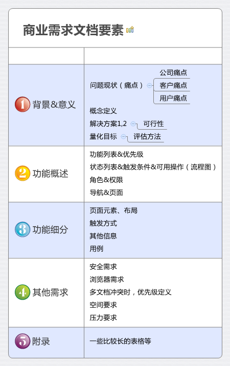

# 项目搭建与首页开发

- 软件开发有那几个生命周期
- 如何启动一个大型前端项目
- BRD 是什么？SRS 是什么
- React 项目的架构标准是什么
- Ant Design 是什么
- 如何处理复杂的 ui 布局？

## 【项目规划】网站开发设计指南

一个新项目，需要做的第一件是是什么？

正确的项目启动流程


什么是业务？

四条主线业务：

- 展示旅游线路 - 产品模块
  - 主页推荐
  - 关键词搜索
- 网站登录 - 用户模块
  - 新用户注册
- 购物车结算 - 购物模块
  - 添加购物车
  - 删除购物车
- 下单购买 - 订单模块
  - 订单历史记录

前后端分离构建原则：

- 遵循目前主流的前后端分离构建原则

**项目流程规划：**

- 需求分析 - 系统设计 - 开发 - 测试 - 上线

需求分析

- 《业务需求文档》(Business Requirements Document, 简称BRD)



## 【项目启动】系统设计与项目初始化

系统设计

- 界面设计：《UI设计规范》
- 系统设计：《需求设计规范》(Software Requirements Specification, 简称SRS)

软件需求设计规范

功能性需求：

1. 网站可以打开
2. 顶部导航栏、走马灯、热门推荐等

非功能性需求：

1. 使用 React + TS 编写
2. 代码逻辑必须清晰

软件需求：

1. 不同使用环境，针对不同的用户群体，所需要的设计规范也是不一样的
2. 实际工作中，则更多的是需要考虑网站的性能、速度、以及架构上的要求

**开发环境搭建：**

```bash
npx create-react-app react-ts-app --template typescript

npm install -D typescript-plugin-css-modules

# 配置 .vscode、custom.d.ts、tsconfig.json
```

## 【主页开发】Header、Footer

UI 库：

- Ant Design
- React Bootstrap
- Material UI
- Semantic UI React

```bash
yarn add antd @antd-design/icons
```
