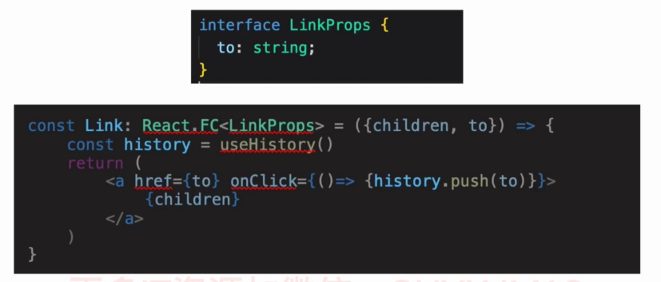

# 路由系统 React Router Dom

- 什么是 SPA
- 什么是路由？什么是虚拟路由
- 如何在 TS 项目中配置 raect-router
- 如何进行页面切换
- 使用 raect-router 来处理路由需要满足哪些要求
- 如何跨组件传递路由数据
    - withRouter vs useTouter
- history.push() vs `<Link />`

## 【概念理解】路由与SPA

SPA：单页网站应用

路由是什么

- 传统网站：当浏览器的 url 发送变化时，浏览器页面相应的发生变化
- 现代的路由方式：
    - React、Angular、Vue，前后端分离，路由架构彻底改变
    - 前端服务 - SPA
    - 后端 PAI  - 数据库

SPA 是什么

- JS 劫持浏览器路由，生成虚拟路由来动态渲染页面 DOM 元素
- 符合前后端分离的趋势，服务端不负责 UI 输出，而专注于数据支持
- 同时支持桌面 APP、手机 APP、网站APP

React 路由框架

- 综合性路由框架：react-router
- 浏览器路由框架：react-keeper
- 手机app 框架(raect-native)：raect-navigation

react-router：最主流、也是最完整的 React 路由解决方案

## 【路由初始化】配置 react-router

- react-router：https://reactrouter.com/
- react-router-dom 用于浏览器，处理 Web app 的路由
- react-router-native 用于 React Native，处理手机 APP 的路由
- react-router-redux：提供了路由中间件，处理 redux 的集成
- react-router-config：用来配置静态路由

react-router-dom

- 会自动安装 react-router 核心框架
- `<Link />` 组件可以渲染出 `<a />` 标签
- BrowserRouter 组件利用 H5 API 实现路由切换
- HashRouter 组件则利用原生 JS 中的 window.location.hash 来实现路由切换

```bash
npm install react-router-dom

npm install @types/react-router-dom -D
```

## 【路由架构】基础路由系统

```js
import React from 'react';
import styles from "./App.module.css";
import { BrowserRouter, Route, Switch } from "react-router-dom";
import { HomePage } from "./pages";

function App() {
  return (
    <div className={styles.App}>
      <BrowserRouter>
        <Switch>
          <Route exact path="/" component={HomePage} />
          <Route path="/signIn" render={() => <h1>登录页面</h1>} />
          <Route render={() => <h1>404 not found 页面去火星了 ！</h1>} />
        </Switch>
      </BrowserRouter>
    </div>
  );
}
```

## 【路由搭建】页面导航

```js
import React from 'react';
import styles from "./App.module.css";
import { BrowserRouter, Route, Switch } from "react-router-dom";
import { HomePage, SignInPage, RegisterPage, DetailPage } from "./pages";

function App() {
  return (
    <div className={styles.App}>
      <BrowserRouter>
        <Switch>
          <Route exact path="/" component={HomePage} />
          <Route path="/signIn" component={SignInPage} />
          <Route path="/register" component={RegisterPage} />
          <Route path="/detail/:touristRouteId" component={DetailPage} />
          <Route render={() => <h1>404 not found 页面去火星了 ！</h1>} />
        </Switch>
      </BrowserRouter>
    </div>
  );
}
```

网站路由系统的要求：

- 路由导航与原生浏览器行为一致
    - BrowserRouter
- 路由的路径解析原理与原生浏览器一致，可以自动识别 url 路径
    - Route
- 路径的切换以页面为单位，不要页面堆叠
    - Switch

如何在 URL 中添加参数？

1. 最常见的使用 '?' 来引导参数
    - http://abc.com/path?name1=value1&name2=value2
2. 分段路由 Segments
    - RESTful 思维方式，参数作为 URL 片段的一部分，使用斜杠 "/"
    - http://abc.com/products/1314520

```jsx
<Route path="/detail/:touristRouteId" component={DetailPage} />
```

```jsx
import React from "react";
import { RouteComponentProps } from "react-router-dom";

interface MatchParams {
  touristRouteId: string;
}

export const DetailPage: React.FC<RouteComponentProps<MatchParams>> = (
  props
) => {
    //   console.log(props.history);
    //   console.log(props.location);
    //   console.log(props.match);
  return <h1>路游路线详情页面, 路线ID: {props.match.params.touristRouteId}</h1>;
};
```

## 【路由搭建】withRouter 与 useRouter

跨组件的数据传递

- 使用上下文关系对象 context 来实现
- HOC 高阶组件
- 函数式组件，使用 hooks 钩子

**withRouter：**

```jsx
import { withRouter, RouteComponentProps } from "react-router-dom";

const ProductImageComponent: React.FC<PropsType> = ({
  history,
  location,
  match
}) => {
  // console.log(history)
  // console.log(location)
  // console.log(match)
  return (
    <div onClick={() => history.push(`detail/${id}`) }>
        // ...
    </div>
  );
};

export const ProductImage = withRouter(ProductImageComponent);
```

useRouter：

```jsx
const history = useHistory();
const location = useLocation();
const params = useParams();
const match = useRouteMatch();

// console.log(history)
// console.log(location)
// console.log(params)
// console.log(match)
```

## 【路由搭建】Link 与动态导航

```jsx
import { withRouter, RouteComponentProps, Link } from "react-router-dom";

return (
<Link to={`detail/${id}`}>
    // ...
</Link>
);
```

Link 原理：



## 链接

- https://www.jianshu.com/p/d991a4a55ae1
- https://www.jianshu.com/p/53dc287a8020
