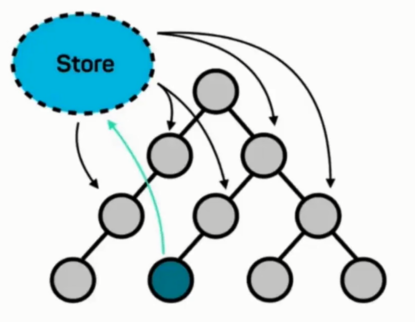
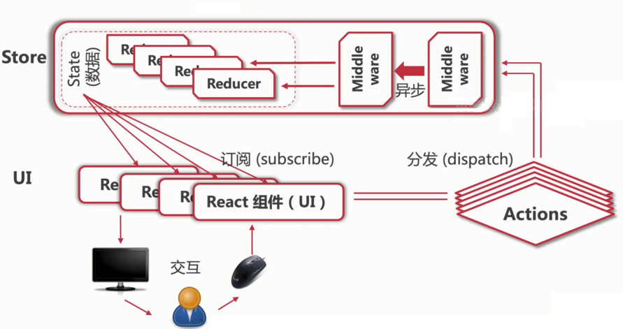
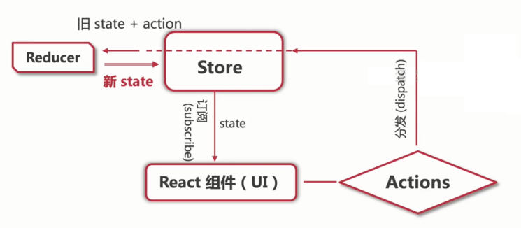

# Redux 入门 - 实战项目架构设计

## 【概念理解】什么是 redux ？

- redux： https://redux.js.org/

React 实际上只是 UI 框架

- 通过 JSX 生成动态 DOM 渲染 UI
- 没有架构、没有模板、没有设计模式、没有路由、没有数据管理

**设计模式与数据管理缺一不可**

- 只使用 React 是没办法开发大型应用的【思考？】

设计模式：

- MVC、MVVM、MV*
- 针对 React 项目，我们有 redux
- Angular：ng-redux
- Vue：vuejs-redux

redux：

- 剥离组件数据(state)
- 数据统一存放在 store
- 组件`订阅` store 获得数据
- store 同步推送数据更新



`Redux 统一保存数据，在隔离了数据与 UI 的同时，负责处理数据的绑定`

什么时候需要使用 Redux ?

- 组件需要共享数据的时候
- 某个状态需要在任何地方都可以随时被访问的时候
- 某个组件需要改变另一个组件的状态的时候
- 语言切换、黑暗模式切换、用户登录全局数据共享

Redux 看似挺简单：

- 非也
- 数据流动不直观，类似事件驱动
    - 调试(debug)困难
- 使用了很多晦涩难懂的专业术语
    - Action、Reducer、Dispatch ...
- 文档稀烂，还不断的引入各种新的概念
    - 如纯函数、immutable、observable、flux ...

真实项目中的 Redux 架构：



Redux 工作流：



Redux：

1. 【创建state】createStore
1. 【访问state】获取store数据 store.getState();
1. 【更新state】Action与Reducer处理
1. 【订阅state】store的连接与订阅  store.subscribe(this.handleStoreChange);
1. 【redux重构】action 的拆分与统一

## I18n：网站国际化

- i18n（其来源是英文单词 internationalization 的首末字符i和n，18为中间的字符数）是“国际化”的简称

原理：

- 语言包作为静态资源单独保存：xml、json
- 每种语言对应一个文件
- 切换语言设置时，语言文件也会随之切换

I18n 工具：

- i18nnext：目前最主流的框架
- react-i18nnext：i18nnext 的 React 版本

react-i18nnext：

- 文档：https://react.i18next.com/

```bash
npm install react-i18next i18next --save
```

i18n/configs.ts

```js
import i18n from "i18next";
import { initReactI18next } from "react-i18next";

import translation_en from "./en.json";
import translation_zh from "./zh.json";

const resources = {
  en: {
    translation: translation_en,
  },
  zh: {
    translation: translation_zh,
  },
};

i18n
  .use(initReactI18next) // passes i18n down to react-i18next
  .init({
    resources,
    lng: "zh",
    // keySeparator: false, // we do not use keys in form messages.welcome
    // header.slogan
    interpolation: {
      escapeValue: false, // react already safes from xss
    },
  });

export default i18n;
```

类组件：

```jsx
import { withTranslation, WithTranslation } from "react-i18next";

class HomePageComponent extends React.Component<WithTranslation> {
  render() {
    // console.log(this.props.t)
    const { t } = this.props;
     return (
      <div>{t("home_page.hot_recommended")}</div>
    )
  }
```

函数组件：

```jsx
import { useTranslation } from "react-i18next";

export const Footer: React.FC = () => {
  const { t } = useTranslation();
  return (
    <Layout.Footer>
        {t("footer.detail")}
    </Layout.Footer>
  );
};
```

```jsx
import i18n from "i18next";

i18n.changeLanguage(action.payload); // 这样处理是不标准的，有副作用
```

## Action Creator (工厂模式)

```jsx
export const CHANGE_LANGUAGE = "change_language";

interface ChangeLanguageAction {
  type: typeof CHANGE_LANGUAGE;
  payload: "zh" | "en";
}

export const changeLanguageActionCreator = (
  languageCode: "zh" | "en"
): ChangeLanguageAction => {
  return {
    type: CHANGE_LANGUAGE,
    payload: languageCode,
  };
};
```

## 【redux封装】在类组件中使用 react-redux

- https://react-redux.js.org/

```bash
npm install react-redux

npm install @types/react-redux -D
```

```jsx
import React from 'react'
import ReactDOM from 'react-dom'

import { Provider } from 'react-redux'
import store from './store'

import App from './App'

const rootElement = document.getElementById('root')
ReactDOM.render(
  <Provider store={store}>
    <App />
  </Provider>,
  rootElement
)
```

```jsx
import { connect } from "react-redux";
import { Dispatch } from "redux";

const mapStateToProps = (state: RootState) => {
  return {
    language: state.language,
    languageList: state.languageList
  }
}

const mapDispatchToProps = (dispatch: Dispatch) => {
  return {
    changeLanguage: (code: "zh" | "en") => {
      const action = changeLanguageActionCreator(code);
      dispatch(action);
    },
    addLanguage: (name: string, code: string) => {
      const action = addLanguageActionCreator(name, code);
      dispatch(action);
    },
  };
};

type PropsType = RouteComponentProps & // react-router 路由props类型
  WithTranslation & // i18n props类型
  ReturnType<typeof mapStateToProps> & // redux store 映射类型 
  ReturnType<typeof mapDispatchToProps>; // redux dispatch 映射类型 

class HeaderComponnet extends React.Component<PropsType> {
    // ...
}

export const Header = connect(mapStateToProps, mapDispatchToProps)(
  withTranslation()(withRouter(HeaderComponnet))
);
```

RootState 类型：

```jsx
import { createStore } from 'redux';
import languageReducer from "./language/languageReducer";

const store = createStore(languageReducer);

export type RootState = ReturnType<typeof store.getState>

export default store;
```

## 【redux封装】在函数式组建中使用 react-redux

```jsx
import { useSelector } from "react-redux";
import { RootState } from "../redux/store";

const language = useSelector((state: RootState) => state.language);
```

使用 TypedUseSelectorHook ，添加类型定义：

```jsx
import {
  useSelector as useReduxSelector,
  TypedUseSelectorHook,
} from "react-redux";
import { RootState } from "./store";

export const useSelector: TypedUseSelectorHook<RootState> = useReduxSelector;
```

```jsx
import { useSelector } from "../../redux/hooks";
import { useDispatch } from "react-redux";
import { Dispatch } from "redux";


const language = useSelector((state) => state.language);

const dispatch = useDispatch();
// const dispatch = useDispatch<Dispatch<LanguageActionTypes>>();

dispatch(changeLanguageActionCreator(e.key));
```
