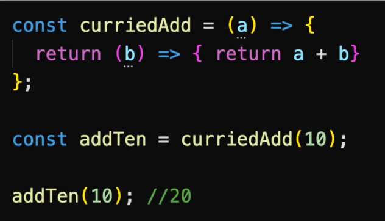
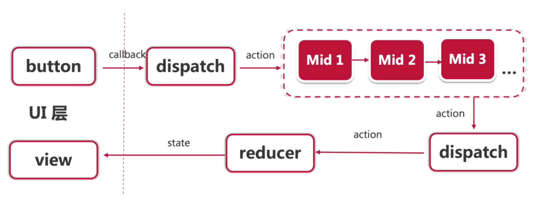

# 进击的 Redux - 异步AJAX与redux中间件

带着问题来学习

- 什么是 RESTful。对前端来说 RESTful 意味着什么
- MVC和 Redux 有什么区别
- combinRedux 有什么用
- 如何使用 redux-thunk（ThunkAction）来处理异步
- 如何处理 redux 副作用
- 什么是 redux 中间件
- 为什么 redux 中间件是个 store -> dispatch -> action 的三个连环嵌套函数
- 如何自定义中间件

## 【概念理解】RESTful

前后端是分离的，但业务是连续的

历程：

- JSP、Silverlight、ASP .NET WebForm
- 移动端的流行、组件化网站开发
- RESTful 的理念逐渐深入人心

RESTful：

- 历史的必然选择
- 语义明确、轻量级、而且结构简单

REST：Representational State Transfer  表征性状态转移
- https://www.runoob.com/w3cnote/restful-architecture.html

RESTful 的基本特点：

- 无状态
- 面向资源
- 使用 HTTP 的动词
- HATOAS 超媒体即应用状态引擎：hypermedia as the engine of application state


RESTful API 到底好用吗？

- 有某些情况非常好用，某些情况非常不好用
- 好用：面向对象（资源），如增删改查
- 不好用：面对过程，如 登录
    - api/login 应该用 GET 还是 POST？

## 【API连接】AJAX 异步获取推荐数据

Axios：

- 简单易用，API 接近于 jQuery，比原生的 fetch 简单
- 浏览器兼容性好，都能兼容至 IE7 ，使用 fetch 就得自己处理兼容
- 通用性好，能在 node 和浏览器中使用，api 一致

```bash
npm i axios
```

## 【概念理解】Redux vs MVC

目前的设计模式

- 混搭
- Header 导航栏使用的是 redux 架构
- 主页的内容，则更倾向于 MVC 的架构

什么是 MVC？

- 一种架构模式，同时也是一种思想
- 模型 Model、视图 View、控制器 Controller
- 分离业务操作、UI 显示、逻辑控制

视图 View

- 用户交互界面
- 仅展示数据，不处理数据
- React 项目的 JSX 代码

模型 Model

- MVC 架构的核心
- 表示业务模型或数据模型
- 业务逻辑，如算法实现、数据的管理、输出对象的封装等等

控制器 Controller

- 接受用户的输入，并调用模型和视图去完成用户的请求处理
- 不处理数据
- React -> MVVM 或者 MV*(whatever)

`React 项目不提倡使用 MVC 架构`

MVC 架构的数据是如何流动？


主流框架：

- React 使用 Redux、Flux、Mobx
- Vue 使用 Vuex
- Angular 使用 Rxjs

Redux 架构


Redux 与 MVC 的关系：

- 以下说法极不准确，仅作为理解两种架构模式的辅助手段
- React - View
- Redux - Controller
- State + Reducer => Model

## 【reducer管理】combineReducers

```jsx
import { createStore, combineReducers } from 'redux';
import languageReducer from "./language/languageReducer";
import recommendProductsReducer from "./recommendProducts/recommendProductsReducer";

const rootReducer = combineReducers({
    language: languageReducer,
    recommendProducts: recommendProductsReducer
})

const store = createStore(rootReducer);

export type RootState = ReturnType<typeof store.getState>

export default store;
```

## 【中间件】使用 redux-thunk 中间价实现异步 action

- redux-thunk：https://github.com/reduxjs/redux-thunk

```jsx
import { createStore, combineReducers, applyMiddleware } from 'redux';
import languageReducer from "./language/languageReducer";
import recommendProductsReducer from "./recommendProducts/recommendProductsReducer";
import thunk from "redux-thunk";

const rootReducer = combineReducers({
    language: languageReducer,
    recommendProducts: recommendProductsReducer
})

const store = createStore(rootReducer, applyMiddleware(thunk));

export type RootState = ReturnType<typeof store.getState>

export default store;
```

```jsx
// thunk 可以返回一个函数，而不一定是js对象
// 在一个thunk action中可以完成一些列连续的action操作
// 并且可以处理异步逻辑
// 业务逻辑可以从ui层面挪到这里，代码分层会更清晰
export const giveMeDataActionCreator = (): ThunkAction<
  void,
  RootState,
  unknown,
  RecommendProductAction
> => async (dispatch, getState) => {
  dispatch(fetchRecommendProductStartActionCreator());
  try {
    const { data } = await axios.get(
      "http://123.56.149.216:8080/api/productCollections"
    );
    dispatch(fetchRecommendProductSuccessActionCreator(data));
  } catch (error) {
    dispatch(fetchRecommendProductFailActionCreator(error.message));
  }
};
```

## 【中间件】什么是中间件

函数式编程

- 复合函数

    
- 柯里化

    

为什么需要中间件？

- redux 的核心，就是控制和管理所有的数据输入输出
- 因此有了  store、reducer 以及 action 的 dispatch

Redux 中间件机制

- 提供了一个分类处理 action 的机会

原始的：


加入 Middleware 后：



Redux 的异步处理：

- redux-thunk
- redux-promise
- redux-saga

Redux 中间件公式：

```jsx
export const middleware = (store) => (next) => (action) => {
    // ...
};

// 执行如下：
// middleware(store)(next)(action);
```

## 【中间件】自定义中间件 actionLog

```jsx
import { Middleware } from "redux";

export const actionLog: Middleware = (store) => (next) => (action) => {
  console.log("state 当前", store.getState());
  console.log("fire action ", action);
  next(action);
  console.log("state 更新", store.getState());
};
```

```jsx
import { actionLog } from "./middlewares/actionLog";

const store = createStore(rootReducer, applyMiddleware(thunk, actionLog));
```

## 【RESTful进阶】Richardson成熟度模型与HATOAS

- 马丁大神的博客
- https://martinfowler.com/articles/richardsonMaturityModel.html
- 中文翻译：https://blog.csdn.net/dm_vincent/article/details/51341037

RESTful 之父罗伊大神曾经说过：

`“只有使用了超媒体的才能算是真正的 REST”`

`REST APIs must be hypertext-driven——Posted by Roy T. Fielding`

- https://roy.gbiv.com/untangled/2008/rest-apis-must-be-hypertext-driven


LEVEL 0：

- 只要有个 api
- 通过 http 传输数据
- 比如：简单对象访问协议 SOAP


LEVEL 1 - 资源：

- 面向资源


LEVEL 2 - HTTP 动词：

- HTTP 语法


LEVEL 3 - 超媒体控制(Hypermedia Controls)

- `HATEOAS`(Hypertext As The Engine Of Application State) 超媒体即应用状态引擎的实现
- api 的`自我发现机制`
- 超媒体(Hypermedia) = 多媒体(multimedia) + 超文本(hypertext)

Restful API 范例：

- GIthub ： https://docs.github.com/cn/rest
- 豆瓣：
    - https://developers.douban.com/wiki/?title=api_v2
    - https://github.com/zce/douban-api-docs
    - https://douban-api-docs.zce.me/
