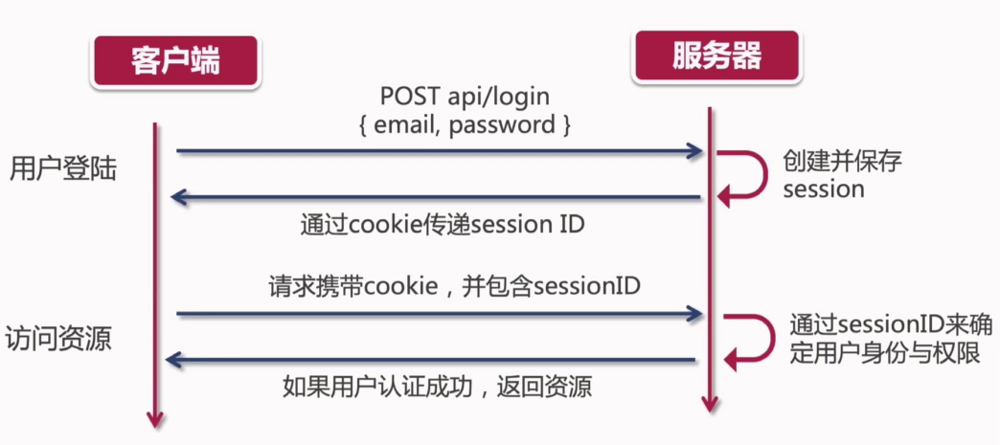

# 业务实践

- 什么是 DRY 原则
- 如何使用 Ant Design 中的表单组件进行数据验证
- 什么是 http 状态，常见 的状态码有哪些
- JWT 是什么？它的实现原理是什么
- JWT 与 session 有什么区别
- 如何 decode jwt？
- 如何持久化 redux 状态

## 【概念理解】Status Code 的重要性

HTTP 状态码

- 用户可以知道服务器是正常处理了请求，还是出现什么错误
- 一个`三位数的状态码`和一个`字符串格式状态消息`组成
- 数字码便于程序进行处理，而消息字符串更方便开发者理解

HTTP 状态码被分为五大类：


常见状态码：


## 【概念理解】JWT 原理剖析

- JWT：JSON Web Token
- JWT 的作用是`用户授权（Authorization）`，而不是用户的`身份认证（Authentication）`

授权（Authorization） VS 认证（Authentication）

- 用户认证指的是使用用户名、密码来验证当前用户的身份
  - 就是用户登录
  - 错误状态码：401 unauthorized（未授权）
- 用户授权指当前用户有足够的权限访问特定的资源
  - 错误状态码：403 forbidden （禁止访问）

传统的 Session 登录

- 用户登录后，服务器会保存登录的 Session 信息
- Session ID 会通过cookie 传递给前端
- http 请求会附带 cookie
- 有状态登录

JWT 彻底改变了用户授权与认证的过程：

- 替换 cookie
- JWT 信息值需要保存在客户端
- 无状态登录

有状态登录 VS 无状态登录

- Session 需要保存在服务器上，而 Session ID 则需要保存在前端 cookie 中
- JWT 信息只需要保存在客户端
- 无状态登录优势：分布式部署

有状态登录 Session：



无状态登录 JWT：


## 【JWT实例】JWT 与单点登录实例解释

- https://jwt.io/


JWT 原理：非对称加密算法 RSA

常用的单点登录（SSO）系统：

- 企业级的付费框架 ForgeRock、微软的 Micriosoft AM
- 开源框架 OpenAM、OpenIDM、OpenDJ

JWT 的优点：

- 无状态，简单、方便，完美支持分布式部署
- 非对称加密，Token 安全性高

JWT 的缺点：

- 无状态，token 一经发布则无法取消
  - 无解。。。
- 明文传递，Token 安全性低
  - 使用 https 解决

## jwt_decode

```jsx
import jwt_decode, { JwtPayload as DefaultJwtPayload } from "jwt-decode";

const jwt = useSelector(s => s.user.token)
const [username, setUsername] = useState("")

useEffect(()=>{
  if(jwt){
    const token = jwt_decode<JwtPayload>(jwt)
    setUsername(token.username)
  }
}, [jwt])
```

## 【redux-persist】登录持久化

- redux-persist：https://www.npmjs.com/package/redux-persist

npm i redux-persist -S

```jsx
import languageReducer from "./language/languageReducer";
import recommendProductsReducer from "./recommendProducts/recommendProductsReducer";
import { actionLog } from "./middlewares/actionLog";
import { productDetailSlice } from "./productDetail/slice";
import { combineReducers, configureStore } from "@reduxjs/toolkit";
import { productSearchSlice } from "./productSearch/slice";
import { userSlice } from "./user/slice";
import { persistStore, persistReducer } from "redux-persist";
import storage from "redux-persist/lib/storage";

const persistConfig = {
  key: "root",
  storage,
  whitelist: ["user"]
}

const rootReducer = combineReducers({
    language: languageReducer,
    recommendProducts: recommendProductsReducer,
    productDetail: productDetailSlice.reducer,
    productSearch: productSearchSlice.reducer,
    user: userSlice.reducer
})

const persistedReducer = persistReducer(persistConfig, rootReducer)

// const store = createStore(rootReducer, applyMiddleware(thunk, actionLog));
const store = configureStore({
  reducer: persistedReducer,
  middleware: (getDefaultMiddleware) => [...getDefaultMiddleware(), actionLog],
  devTools: true,
});

const persistor = persistStore(store)

export type RootState = ReturnType<typeof store.getState>

export default { store, persistor };
```

