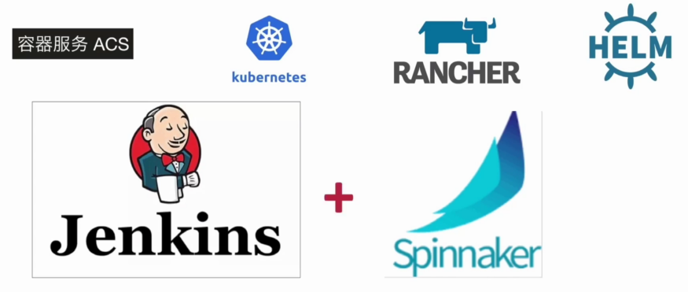
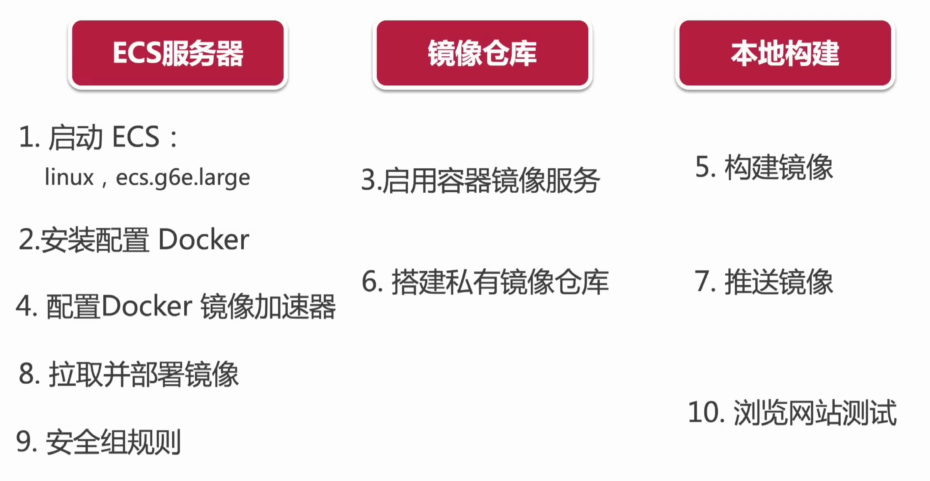

# 项目上线 - 网站测试与部署

- 如何使用 node 静态服务器部署网站？
- 什么是容器化？什么是 docker？docker 有什么特征？
- Register、Image、Container 是什么
- 什么是 Dockerfile ？如何使用 Dockerfile
- 如何实现阿里云上线？

## 部署方案

- 方案一：使用本地服务器来托管网站
- 方案二：容器化部署

## 【静态部署】本地服务器托管

- https://create-react-app.dev/docs/deployment

```bash
npm install -g serve

npm i

npm run build

serve -s build # or serve -s build -l 4000
```

## 【概念理解】5 分钟带你认识 Docker

Docker

- 开源的容器化虚拟技术
- 可移植
- 非常轻量级

Docker 与容器化


Docker 的出现：

- 脱离硬件
- 可移植的容器
- 直接运行在宿主机内核上

与传统虚拟机对比：


Docker 的三个核心概念：

- Registry 镜像仓库：
    - 如：Docker Hub https://registry.hub.docker.com/
        - https://hub.docker.com/
- Image 镜像：
    - docker 命令拉取镜像  docker pull node
- Container 容器：
    - 容器启动命令 docker run
        - `docker run -it <image> /bin/bash`

镜像、容器、仓库三者的关系：


Docker 常用命令：


## 【速查表】常用的 docker 命令


## 【环境搭建】容器化方案与 Docker 配置

Windows 10 `专业版`，开启 `Hyper-V`

- https://www.docker.com/

```bash
docker pull center:latest  # 拉取最新版 centos 镜像

docker images # 查看拉取结果

docker run -p 9566:80 --name web -i -t centos /bin/bash

rpm -ivh http://nginx.org/packages/centos/6/noarch/RPMS/nginx-release-centos-6-0.el6.ngx.noarch.rpm

# 安装 nginx
yum -y install nginx

whereis nginx

# 启动nignx
service nginx start

# 查看nginx启动进程和配置文件
ps -ef|grep nginx


# 浏览器访问 http://localhost:9566
```

## 【速查表】Dockerfile 语法


## 【容器化改造】理解 Dockerfile 全过程

两种方式构建 Docker 镜像

- docker commit
- docker build + Dockerfile （推荐）

Dockerfile

```txt
# 第一个阶段: 拉取node镜像来打包React项目
FROM node:14 as build
WORKDIR /app
COPY package*.json ./
RUN npm install
COPY tsconfig.json ./
COPY public public/
COPY src src/
RUN npm run build

# 第二个阶段: 创建并运行Ngnix服务器，并且把打包好的文件复制粘贴到服务器文件夹中
FROM nginx:alpine
COPY --from=build /app/build/ /usr/share/nginx/html
EXPOSE 80
CMD ["nginx", "-g", "daemon off;"]
```

```bash
docker buidl -t raect-web .  # 不要漏掉最后的点

docker run -p 1234:80 --name react-web

docker ps
```

## 【容器化上线】实现阿里云部署

- 阿里云账号+实名认证
- ECS

阿里云两个服务

- 容器镜像服务 (ACR)
    - 类似：私人的 docker 镜像仓库
- 阿里云 ECS 服务器
    - linux 操作系统，安装和运行 docker 服务

容器化部署方案：



容器化部署大致思路：



```bash
yum update
yum install epel0release -y
yum clean all
yum list

yum install docker-io

systemctl start docker

docker info

# 创建镜像加速器
# ...

```


进入本地项目目录：

```bash
docker buidl -t raect-web .

docker image

docker
```

镜像控制台·新建镜像，根据文档上传镜像。


## # 如何确保Docker Daemon与数据库处于运行状态

## 1. 检查docker服务是否运行
### Windows:
点击任务栏的隐藏/显示按钮, 确认 docker 的小鲸鱼图标正在运行。如果看不到这个图标则表示docker服务没有运行，继续执行第二步“运行docker服务”，否则可以直接跳到第三步

### MAC 
在顶部任务栏中确认确认 docker 的小鲸鱼图标正在运行。如果看不到这个图标则表示docker服务没有运行，继续执行第二步“运行docker服务”，否则可以直接跳到第三步


## 2. 运行docker服务
### Windows:
搜索并运行 “Docker Desktop” 应用程序

然后再任务栏中会看到小鲸鱼图标，“Docker Desktop is starting”


### MAC 
在应用列表中找到小鲸鱼，点击运行


## docker 命令

## docker 安装及设置

```bash
#安装 CentOS已经将Docker软件包放在了Extras软件源中，直接利用即可
yum install docker-io -y

#查看docker的版本 version
docker -v

#开启Docker服务
systemctl start docker.service

#开机启动Docker服务
systemctl enable docker.service

#查看Docker服务启动状态
systemctl status docker.service

#重启Docker服务
systemctl restart docker.service
```

## docker 镜像文件和容器命令
```bash
#查看所有镜像
docker images

#删除一个imageid的镜像
docker rmi [IMAE_ID] 

#删除所有镜像
sudo docker rmi $(docker images -q) 

#查看所有容器运行状态
docker ps -a    
docker container ls -all

#删除一个containerid的容器(实例)
docker rm 6f0c67de4b72 

#删除所有容器
docker rm $(sudo docker ps -a -q)

容器日志
#查看指定时间后的日志，只显示最后100行：
docker logs -f -t --since="2019-06-08" --tail=100 CONTAINER_ID

#查看某时间之后的日志：
docker logs -t --since="2019-06-08" CONTAINER_ID

#查看某时间段日志：
docker logs -t --since="2019-06-08" --until "2019-06-09" CONTAINER_ID

#查看最近30分钟的日志:
docker logs --since 30m CONTAINER_ID

# 设置启动策略, docker 容器自动启动（在容器退出或断电开机后，docker可以通过在容器创建时的 --restart 来指定重启策略）
#--restart 参数：
  # no，不自动重启容器. (默认值)
  # on-failure，  容器发生error而退出(容器退出状态不为0)重启容器,可以指定重启的最大次数，如：on-failure:10
  # unless-stopped，  在容器已经stop掉或Docker stoped/restarted的时候才重启容器，手动stop的不算
  # always， 在容器已经stop掉或Docker stoped/restarted的时候才重启容器
docker run --restart always -it -p {本机端口}:{容器端口} {镜像名称}

#如果容器已经被创建，但处于停止状态，重新启动：
docker start {容器ID}

#如果容器已经被创建，我们想要修改容器的重启策略
docker update --restart always {容器ID}
```
