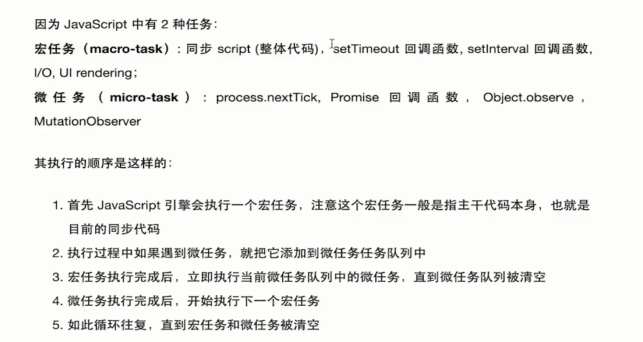

# 用户体验优化 - 加载中和错误状态处理

## 用高级 Hook-useAsync 统一处理 Loading 和 Error 状态

```js
import { useState } from "react";

interface State<D> {
  error: Error | null;
  data: D | null;
  stat: "idle" | "loading" | "error" | "success";
}

const defaultInitialState: State<null> = {
  stat: "idle",
  data: null,
  error: null,
};

const defaultConfig = {
  throwOnError: false,
};

export const useAsync = <D>(
  initialState?: State<D>,
  initialConfig?: typeof defaultConfig
) => {
  const config = { ...defaultConfig, ...initialConfig };
  const [state, setState] = useState<State<D>>({
    ...defaultInitialState,
    ...initialState,
  });

  const setData = (data: D) =>
    setState({
      data,
      stat: "success",
      error: null,
    });

  const setError = (error: Error) =>
    setState({
      error,
      stat: "error",
      data: null,
    });

  // run 用来触发异步请求
  const run = (promise: Promise<D>) => {
    if (!promise || !promise.then) {
      throw new Error("请传入 Promise 类型数据");
    }
    setState({ ...state, stat: "loading" });
    return promise
      .then((data) => {
        setData(data);
        return data;
      })
      .catch((error) => {
        // catch会消化异常，如果不主动抛出，外面是接收不到异常的
        setError(error);
        if (config.throwOnError) return Promise.reject(error);
        return error;
      });
  };

  return {
    isIdle: state.stat === "idle",
    isLoading: state.stat === "loading",
    isError: state.stat === "error",
    isSuccess: state.stat === "success",
    run,
    setData,
    setError,
    ...state,
  };
};
```

```js
import { useAsync } from "utils/use-async";
import { Project } from "screens/project-list/list";
import { useEffect } from "react";
import { cleanObject } from "utils/index";
import { useHttp } from "utils/http";

export const useProjects = (param?: Partial<Project>) => {
  const client = useHttp();
  const { run, ...result } = useAsync<Project[]>();

  useEffect(() => {
    run(client("projects", { data: cleanObject(param || {}) }));
    // eslint-disable-next-line react-hooks/exhaustive-deps
  }, [param]);

  return result;
};
```

```js
const { isLoading, error, data: list } = useProjects(debouncedParam);
```

##  Event Loop



## 用 useAsync 获取用户信息

```jsx
export const FullPageLoading = () => (
  <FullPage>
    <Spin size={"large"} />
  </FullPage>
);

export const FullPageErrorFallback = ({ error }: { error: Error | null }) => (
  <FullPage>
    <DevTools />
    <Typography.Text type={"danger"}>{error?.message}</Typography.Text>
  </FullPage>
);
```

```js
  if (isIdle || isLoading) {
    return <FullPageLoading />;
  }

  if (isError) {
    return <FullPageErrorFallback error={error} />;
  }
```

## 实现 Error Boundaries，捕获边界错误

- 错误边界（Error Boundaries）：https://zh-hans.reactjs.org/docs/error-boundaries.html
- https://github.com/bvaughn/react-error-boundary

error-boundary.tsx

```js
import React from "react";

type FallbackRender = (props: { error: Error | null }) => React.ReactElement;

// https://github.com/bvaughn/react-error-boundary
export class ErrorBoundary extends React.Component<
  React.PropsWithChildren<{ fallbackRender: FallbackRender }>,
  { error: Error | null }
> {
  state = { error: null };

  // 当子组件抛出异常，这里会接收到并且调用
  static getDerivedStateFromError(error: Error) {
    return { error };
  }

  render() {
    const { error } = this.state;
    const { fallbackRender, children } = this.props;
    if (error) {
      return fallbackRender({ error });
    }
    return children;
  }
}
```

```js
import React from "react";
import "./App.css";
import { useAuth } from "context/auth-context";
import { AuthenticatedApp } from "authenticated-app";
import { UnauthenticatedApp } from "unauthenticated-app";
import { ErrorBoundary } from "components/error-boundary";
import { FullPageErrorFallback } from "components/lib";

function App() {
  const { user } = useAuth();

  return (
    <div className="App">
      <ErrorBoundary fallbackRender={FullPageErrorFallback}>
        {user ? <AuthenticatedApp /> : <UnauthenticatedApp />}
      </ErrorBoundary>
    </div>
  );
}

export default App;
```
