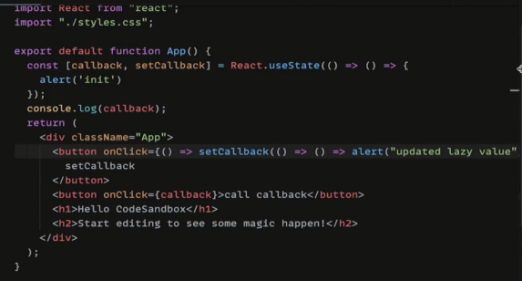

# 户选择器与项目编辑功能

## 实现id-select.tsx解决id类型 难题

```jsx
import React from "react";
import { Raw } from "types";
import { Select } from "antd";

type SelectProps = React.ComponentProps<typeof Select>;

interface IdSelectProps
  extends Omit<SelectProps, "value" | "onChange" | "options"> {
  value: Raw | null | undefined;
  onChange: (value?: number) => void;
  defaultOptionName?: string;
  options?: { name: string; id: number }[];
}

/**
 * value 可以传入多种类型的值
 * onChange只会回调 number|undefined 类型
 * 当 isNaN(Number(value)) 为true的时候，代表选择默认类型
 * 当选择默认类型的时候，onChange会回调undefined
 * @param props
 * @constructor
 */
export const IdSelect = (props: IdSelectProps) => {
  const { value, onChange, defaultOptionName, options, ...restProps } = props;
  return (
    <Select
      value={options?.length ? toNumber(value) : 0}
      onChange={(value) => onChange(toNumber(value) || undefined)}
      {...restProps}
    >
      {defaultOptionName ? (
        <Select.Option value={0}>{defaultOptionName}</Select.Option>
      ) : null}
      {options?.map((option) => (
        <Select.Option key={option.id} value={option.id}>
          {option.name}
        </Select.Option>
      ))}
    </Select>
  );
};

const toNumber = (value: unknown) => (isNaN(Number(value)) ? 0 : Number(value));
```

继承某个组件的 Props 属性

```jsx
type SelectProps = React.ComponentProps<typeof Select>;

interface IdSelectProps
  extends Omit<SelectProps, "value" | "onChange" | "options"> {
  value: Raw | null | undefined;
  onChange: (value?: number) => void;
  defaultOptionName?: string;
  options?: { name: string; id: number }[];
}
```

## 抽象 user-select 组件选择用户

```js
import React from "react";
import { useUsers } from "utils/user";
import { IdSelect } from "components/id-select";

export const UserSelect = (props: React.ComponentProps<typeof IdSelect>) => {
  const { data: users } = useUsers();
  return <IdSelect options={users || []} {...props} />;
};
```

```jsx
import { useUrlQueryParam } from "utils/url";
import { useMemo } from "react";

// 项目列表搜索的参数
export const useProjectsSearchParams = () => {
  const [param, setParam] = useUrlQueryParam(["name", "personId"]);
  return [
    useMemo(
      () => ({ ...param, personId: Number(param.personId) || undefined }),
      [param]
    ),
    setParam,
  ] as const;
};
```

## 用 useEditProject 编辑项目

```jsx
import React from "react";
import { Rate } from "antd";

interface PinProps extends React.ComponentProps<typeof Rate> {
  checked: boolean;
  onCheckedChange?: (checked: boolean) => void;
}

export const Pin = ({ checked, onCheckedChange, ...restProps }: PinProps) => {
  return (
    <Rate
      count={1}
      value={checked ? 1 : 0}
      onChange={(num) => onCheckedChange?.(!!num)}
      {...restProps}
    />
  );
};
```

```jsx
export const useEditProject = () => {
  const { run, ...asyncResult } = useAsync();
  const client = useHttp();
  const mutate = (params: Partial<Project>) => {
    return run(
      client(`projects/${params.id}`, {
        data: params,
        method: "PATCH",
      })
    );
  };
  return {
    mutate,
    ...asyncResult,
  };
};

export const useAddProject = () => {
  const { run, ...asyncResult } = useAsync();
  const client = useHttp();
  const mutate = (params: Partial<Project>) => {
    return run(
      client(`projects/${params.id}`, {
        data: params,
        method: "POST",
      })
    );
  };
  return {
    mutate,
    ...asyncResult,
  };
};
```

使用函数柯里化：

```jsx
const pinProject = (id: number) => (pin: boolean) => mutate({ id, pin });

<Pin
    checked={project.pin}
    onCheckedChange={pinProject(project.id)}
    />
```

## 编辑后刷新 - useState 的懒初始化与保存函数状态

useState直接传入函数的含义是：惰性初始化；所以，要用useState保存函数，不能直接传入函数

```jsx
// 这种会直接执行
const [retry, setRetry] = useState(() => {});

// 注意区分：这种是方案 1
const [retry, setRetry] = useState(() => () => {});
```

解决方案1：



解决方案2：

```jsx
import React from "react";
import "./styles.css";

export default function App() {
  const callbackRef = React.useRef(() => alert("init"));
  const callback = callbackRef.current;
  console.log(callback);
  return (
    <div className="App">
      <button onClick={() => (callbackRef.current = () => alert("updated"))}>
        setCallback
      </button>
        //   注意这里：必须是放在函数内调用，而不是直接读取，因为 Ref 不会重新渲染，直接读取的则是上次的引用
      <button onClick={() => callbackRef.current()}>call callback</button>
      <h1>Hello CodeSandbox</h1>
      <h2>Start editing to see some magic happen!</h2>
    </div>
  );
}
```

## 完成编辑后刷新功能

- 乐观更新
