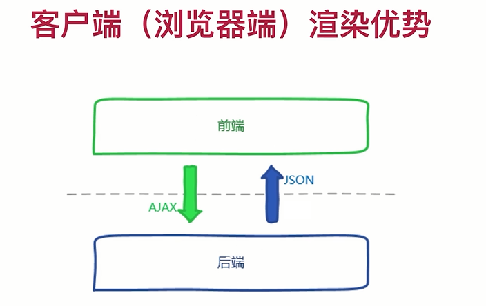
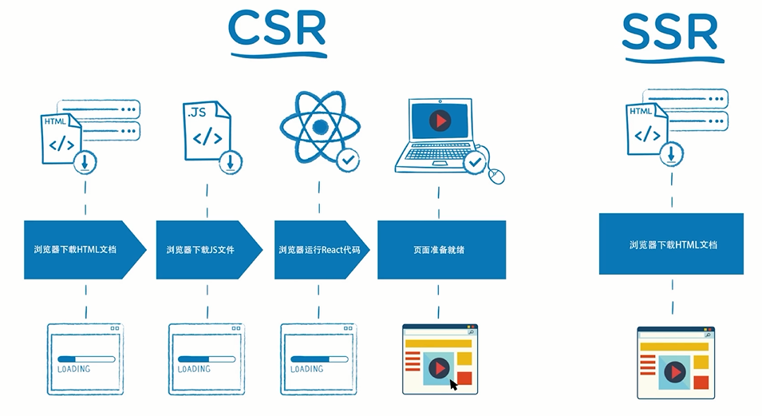

# SSR & CSR

## SSR vs CSR

- TTFP展示时间比较长
- SEO

主流服务器端渲染
- next.js
- nuxt.js

## SSR

- 在框架中实现同构
- 框架中路由机制的实现
- 框架与redux的融合
- 框架作为中间层的职能处理
- 细节调优
- SEO特性
- 预渲染技术

## 相关技术栈

- node、npm
- express
- React
- Reudx
- webpack
- es6

## 相关

基础
- 什么是服务器端渲染？
- 什么是客户端渲染？
- 传统React客户端渲染的优势与弊端

  
同构的概念及实现
- 什么是同构?
- 在浏览器中执行一段js代码
- 让React代码在浏览器上运行
- 工程代码优化整理

  
同构中的路由
- 服务器端渲染中的路由
- 多页面路由跳转
- 使用Link标签串联起整个路由流程

引入Redux
- 创建Store代码的复用
- 构建Redux代码结构
- 如何获取正版的secret码
- 异步数据服务器渲染 : loadData方法及路由重构
- Favicon及多级路由问题的处理
- 服务器端渲染获取数据
- 数据的脱水和注水

完整搭建中间层架构
- 使用proxy代理
- axios中instance的使用
- redux-thunk中的withExtraArgument
- 多级路由的支持
- 登陆功能的制作/接口打通
- 登陆状态切换/cookie传递问题
- 翻译列表展示功能实现

  
框架细节处理
- 增加404页面
- 使用Context处理服务器端加载异常
- 重定向代码的实现
- SEO效果优化

css的webpack配置
- 同构中css文件加载的思路
- 使用webpack对项目css代码打包进行配置
- 引入antd对页面进行完整优化

## React 客户端渲染的优势与弊端

优势

弊端
- SEO

